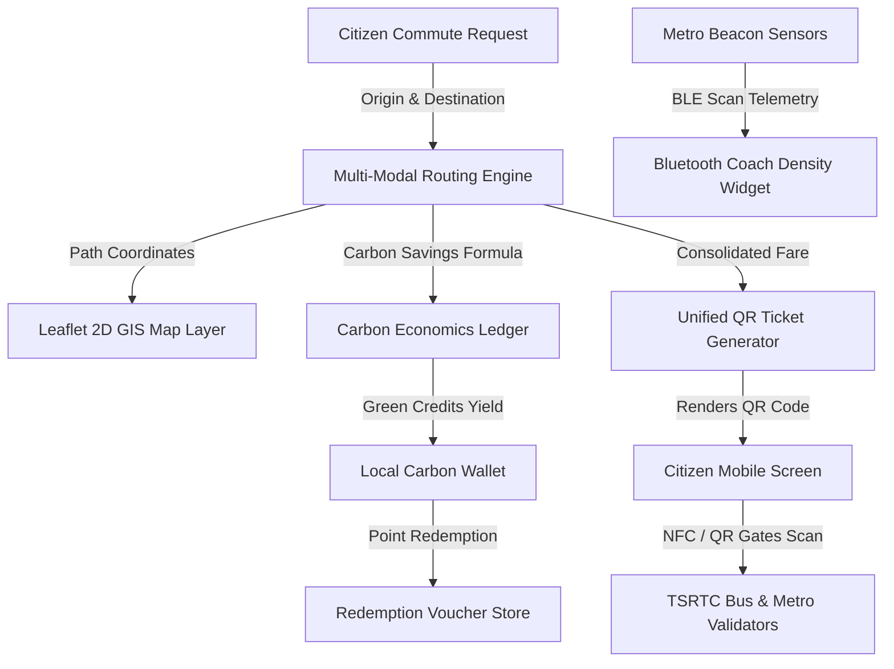

# HydraTransit 🚇 (CivicTech Hackathon Demo)

**HydraTransit** is a sleek, multi-modal transit orchestrator and green-mobility dashboard designed to solve traffic and carbon congestion in Hyderabad, Telangana. 

By integrating **Hyderabad Metro Rail**, **TSRTC Express Buses**, **MMTS local trains**, and last-mile **micro-mobility (electric bikes & shared autos)**, HydraTransit creates a seamless commuting experience while incentivizing public transit usage through a gamified Carbon Credits reward system.

---

## 🌟 Key Features

1. **Multi-Modal Route Planner**: Compiles the ultimate hybrid journey (e.g., *Bus -> Metro -> E-Bike*), calculating total duration, cost, and exact carbon savings dynamically.
2. **Interactive GIS Network Mapping**: Renders active transit layers over a futuristic dark Hyderabad coordinate grid using Leaflet.js and CartoDB Dark Matter. Plots Red, Blue, and Green Metro lines alongside animated TSRTC vehicle trackers.
3. **Bluetooth BLE Coach Radar**: Simulates live Bluetooth beacon scanning inside Metro carriages to track coach crowding levels (Low, Mid, High), directing passengers to open carriages.
4. **Unified QR "Hydra-Pass"**: Consolidates separate agency fares into a single QR pass, automatically generated inside an HTML5 Canvas canvas (zero external dependencies).
5. **Eco Carbon Rewards Hub**: Earn Green Credits for choosing public transit, redeemable for real vouchers at Hyderabad's popular brands (Niloufer Cafe, Karachi Bakery, Metro passes).

---

## 🏗️ Architecture Blueprint



---

## 🚀 Local Installation & Running

Since the project is structured as a premium vanilla HTML/CSS/JS web application, there are **no complex build steps or dependencies to compile**. It is highly lightweight and portable!

### Quick Start:
1. Double-click `index.html` to open it directly in any modern browser.
2. **(Recommended)** Serve the directory locally to enable all advanced browser capabilities and local caching:
   ```bash
   # Using Python 3.x
   python -m http.server 8000
   
   # Using Node.js (if global http-server is installed)
   npx http-server -p 8000
   ```
3. Open `http://localhost:8000` in your web browser.

---

## 🦊 Uploading to GitLab (`code.sweca.org`)

The project is pre-configured with a `.gitignore` and `.gitlab-ci.yml` template, ready for GitLab Pages deployment and pipeline linting. 

To push this project to your GitLab repository, run the following commands in your terminal:

```bash
# 1. Initialize Git repository
git init --initial-branch=main

# 2. Add all project files
git add .

# 3. Commit your initial files
git commit -m "feat: initial commit of HydraTransit multi-modal dashboard"

# 4. Link to your sweca.org GitLab repository
git remote add origin https://code.swecha.org/<your-username>/HydraTransit.git

# 5. Push to the main branch
git push -u origin main
```

Once pushed, GitLab CI will automatically run the configured linter checks and package the static assets for hosting under GitLab Pages!

---

## 💾 Agent Handover & Session Recovery

If your AI session runs out of tokens or you transfer this project to another IDE/AI agent:

1. **State Persistence**: The application auto-saves all user wallet details, carbon points, and current active routes to the browser's `localStorage` namespace on the fly. Simply reloading the page preserves all active work.
2. **System Config Checkpoint**: The `state_checkpoint.json` file in the root directory holds all system parameters, landmark datasets, and task checklists.
3. **Incoming Agent Instructions**: Provide the incoming agent with this simple directive:
   > *"Set `C:\Users\navya\.gemini\antigravity\scratch\HydraTransit` as your active workspace. Read `implementation_plan.md` and `state_checkpoint.json` to immediately synchronize with the current development state."*
